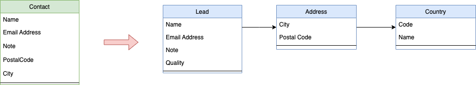

# MicroStream Legacy Type Mapping

Examples of the Legacy Type Mapping of MicroStream

## Automatic mapping

The MicroStream engine can handle 'small' changes automatically. No action is required from the developer when your data model has small changes.  What are 'small' changes?

- Rename a property within a class.
- Add a new property
- Removal of a property.

Within the _automatic_ directory there is an example that you can use to play with this automatic Legacy Type Mapping feature.

The Root object contains a `List<Lead>` collection that keeps the data for our application.  In the _old_ version of the program, the structure of the `Lead` class is

```
private String name;
private int quality;
private String email;
private String note;
private String reference;
```

With the class `Leads` you can fill your data target with a few entries and you can print out the contents of it.  Run this program to get started with this example.

In a second version of the program, you realise

- The field _reference_ was not really useful as people use _note- for this anyway.
- You rename the property _name_ to _contactName_
- You reorder the fields since it makes more sense that the _email_ field is the first.

The code is available in the _new_ module of the project.  You can run the `ShowLeads` class to show the contents of the storage we created with the _old_ version of the program.  Since we only made some _small_ changes, MicroStream has no problem reading the data and showing the List of _Leads_.

You also notice in the log that it mentions that an automatic Legacy Type Mapping is generated for the second version of our class. The _Type Dictionary_ of the storage can contain multiple versions of the same class with its respective layout of the properties.

If we only read the storage, the data is converted into the new layout into memory (the JVM heap) but the storage contains still the data in the old format.  So if we run the `Leads` program in the _old_ module again, we see that all data is still there, including the value of the _reference_ field.

If we change an instance and store it to the storage target, the layout will be the one of the _new_ program.  The update is performed by running the class `UpdateSingleLead`.  We can verify if the update was successful by running the `ShowLeads` program from the _new_ module. But also the old program can still read the data. It detects the new layout of the class and automatically maps it to the old format. This means that for the updated item of the _Lead_ List, the _reference_ field is null now as you can see if you run the `Lead`  program.

So, MicroStream can handle multiple versions of a class at the same time in the storage target. And it will convert it to the layout of the class it is running for the moment. As long as they are _small_ changes. In the next example, we will see how you as a developer can define the mapping for a larger-scale refactoring or change.

But how can you convert your entire database to make use of the new layout, and don't wait until an instance has been changed?  This can be done by forcing storage of all items which will use the new format.  The easiest way to perform this task is to use an `EagerStorer`.

```
Storer eagerStorer = storageManager.createEagerStorer();
eagerStorer.store(root.getLeads());  // Does not write to target.
eagerStorer.commit();  // This does the save to storage.
```

This is done by the program `ConvertStorage` that is available in the _new_ module.

From now on, the `ShowLeads` program does not mention mapping anymore because no data in another format is available than the one the program itself uses. But the old program `Leads` is still able to read the data, just as we did before.

## Manual Mapping

If the automatic mapping doesn't provide you with the desired result, because the mapping based on the Levenshtein distance for words matches incorrect properties, or you have performed a class name refactoring, you can configure the mapping yourself.

The mapping in this example, see directory _manual_ does not involve creating multiple instances as depicted in this class diagram



To handle such cases, have a look at the next section called complex and how a _Legacy Type Handler_ can solve this problem.  For now, we use the simpler _Legacy Type Mapping_ functionality of MicroStream.

In this manual example, we want to rename the class from `Contact` to `Lead` and add, remove and rename a few properties.

When creating and configuring the _StorageManager_ you can provide the mapping that needs to be performed to the `EmbeddedStorageFoundation`.

```
    private static EmbeddedStorageFoundation createFoundation() {
        EmbeddedStorageFoundation<?> foundation = EmbeddedStorage.Foundation(new File("data").toPath());

        PersistenceRefactoringMappingProvider mappingProvider = new CustomMapping();
        foundation.onConnectionFoundation(f -> f.setRefactoringMappingProvider(mappingProvider));
        return foundation;

    }

    private static class CustomMapping implements PersistenceRefactoringMappingProvider {
        @Override
        public PersistenceRefactoringMapping provideRefactoringMapping() {
            KeyValue<String, String> mapping = KeyValue.New("be.rubus.microstream.demo.mapping.automatic.Contact", "be.rubus.microstream.demo.mapping.automatic.Lead");

            XGettingTable<String, String> mappings =
                    HashTable.New(mapping);

            return PersistenceRefactoringMapping.New(mappings);

        }
    }
``` 

In this code snippet, we create the Foundation and provide it with a custom `PersistenceRefactoringMappingProvider` that specifies the old and new class names within the code.

The custom class implements the method `provideRefactoringMapping()` where we prepare a MicroStream Map that indicates the old and new name (here from _Contact_ to _Lead_)

We don't specify the mappings for the properties in this case, as the automatic mapping does a good job in this case.  You can specify the mappings for properties also, like

```
be.rubus.microstream.demo.mapping.automatic.Contact#name;be.rubus.microstream.demo.mapping.automatic.Lead#contactName
```

This is an example of a CSV file that also can be used and is recommended when you have multiple mappings to specify. It shows the format for indicating properties.  
If you have only a value in the _first_ column, this means that the property is deleted. A value in the _second_ column only denotes a new property.

```
foundation.onConnectionFoundation(f -> f.setRefactoringMappingProvider(Persistence.RefactoringMapping(Paths.get("refactorings.csv"))));
```

Just as in the automatic example, the changes are initially only in memory, the storage is still holding the data in the `Contact` structure.  You can use the Eager Storer to store all instances and data o the List in the new format.

If you run the example, you will also experience that MicroStream constructs the Java instances using a very-low level approach. It does not use the classic instantiations to avoid Security vulnerabilities that exist in the standard Java Serialization approach.

In the `Lead` class, we have the assignment of a _default_ country value, but as you see in the printout of the program, all properties have the value _null_.

```
private Country country = Country.DEFAULT;
```

Be aware if you perform mappings that for new properties they are not _initialised_ as expected based on the java code.  Primitive types have their default (0 for int, false for boolean, etc ...) and instances are null, always.

You can play with the example by first running the `Contacts` program in the _old_ module and then the `ShowLeads` program in the _new_ module and see how the data is changed based on the log output information.

## Complex refactoring

Complex refactorings as indicated by the image earlier on where we also create an `Address` and `Country` instance, require the use of a _Legacy Type Handler_, not a simple mapping. The handler can based on the structure of the old class (using primitives and pointers) create an instance of the new class.

This handler cannot handle a renamed class, that needs to be performed separately, but a handler can perform the creation of `Address` and `Country`.

The Handler will need to manipulate the old structure on the byte level, so this solution can become rather complex and difficult. It might require MicroStream Experts to help you create such a _Legacy Type Handler_.

The example is relatively simple since our old class only contains String references and this handler is relatively easy to write.

Have a look at the `LeadLegacyHandler` class and run the `Leads` program in the _old_ module and then the `ShowLeads` in the _new_ module.
